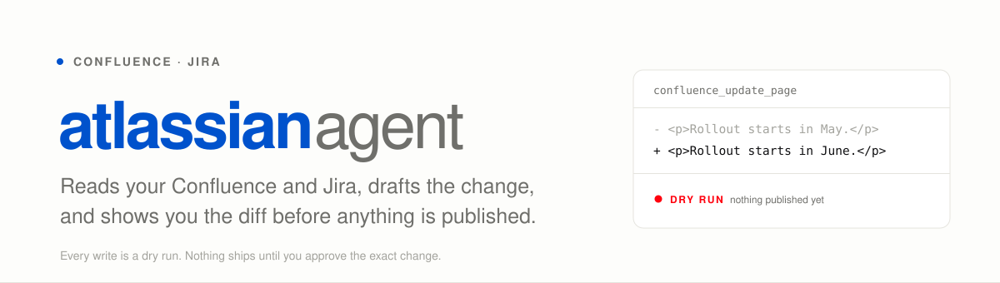
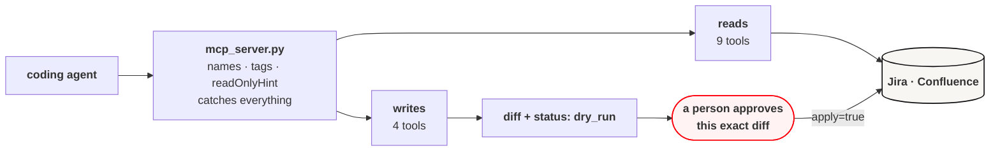

<picture>
  <source media="(prefers-color-scheme: dark)" srcset="docs/assets/banner-dark.svg">
  
</picture>

[](https://github.com/danielvogler/atlassian_agent/actions/workflows/ci.yml)
[](./LICENSE)
[](https://www.python.org/downloads/)
[](https://docs.astral.sh/uv/)
[](https://docs.astral.sh/ruff/)
[](https://mypy-lang.org/)
[](https://pre-commit.com/)
[](https://github.com/gitleaks/gitleaks)

---

## Start here

Clone it, then point your coding agent at **[AGENTS.md](./AGENTS.md)** and tell
it what you want done.

```
Read AGENTS.md and set this up. I want you to be able to read our
Confluence space and file Jira tickets from here.
```

That file is written for exactly this: setup, the thirteen tools, and — the
part that matters — the rules an agent has to follow before it writes anything
to a system your colleagues are reading.

The rest of this page is what the agent is working from.

---

## What it does

It gives a coding agent an MCP server with **thirteen tools** against a
self-hosted Jira and Confluence. Nine read. Four write.

**Every write is a dry run until somebody says otherwise.** Call
`confluence_append_sentence` and you get back a unified diff and the page it
would land on. Nothing has happened. Passing `apply=true` is a separate,
deliberate second call, made after a person has seen that diff — and that is
the point, because the failure mode here is not an agent that cannot edit a
wiki. It is an agent that edits the wrong one, confidently, while nobody is
looking.

**Confluence page writes also carry the version that was read.** If the page
moved in between, the update refuses rather than publishing a body built from
a page that no longer exists — which would silently revert whoever edited it in
the meantime. An optimistic-concurrency check is unglamorous and it is the
difference between a tool you can leave running and one you cannot.

---

## Setup

```bash
make setup       # venv, dependencies, git hooks, .env from the template
```

Fill in `.env` with a base URL and a personal access token per service. Both
are sent as `Authorization: Bearer <token>`. Jira is optional — without it the
Confluence tools still work, and the `jira_*` tools return a clear error rather
than failing obscurely.

```bash
CONFLUENCE_URL=https://confluence.example.com
CONFLUENCE_TOKEN=your-personal-access-token
JIRA_URL=https://jira.example.com
JIRA_TOKEN=your-personal-access-token
```

`.env` is gitignored, a pre-commit hook refuses to commit it, and the local
file tools refuse to read it. Check the wiring without spending a credential:

```bash
make mcp-tools   # lists all thirteen tools; never calls Atlassian
```

## Wiring it into an agent

The entrypoint is `scripts/run-atlassian-agent-mcp.sh`, which runs the server
over stdio from the repository's own virtualenv. Register it with whichever
client you use — for Claude Code:

```bash
claude mcp add atlassian-agent -- /absolute/path/to/atlassian_agent/scripts/run-atlassian-agent-mcp.sh
```

For a client configured by file, the shape is the same everywhere:

```json
{
  "mcpServers": {
    "atlassian-agent": {
      "command": "/absolute/path/to/atlassian_agent/scripts/run-atlassian-agent-mcp.sh"
    }
  }
}
```

Restart the client afterwards, then ask it to list its tools. Credentials are
read from this repository's `.env` at call time, so nothing needs to go into
the client's own config.

---

## The tools

Reads — safe to call freely:

| Tool | What it gives you |
|---|---|
| `confluence_get_page` | Title, ID, version, raw storage body |
| `confluence_get_page_family` | A page plus descendants (depth ≤ 4) with text previews, for choosing where to edit |
| `jira_search` | JQL search |
| `jira_get_issue` | One issue by key |
| `jira_get_structure` | Jira Structure metadata |
| `jira_get_structure_forest` | Structure rows: row ID, depth, item identity |
| `jira_get_structure_values` | Text-formatted values for selected Structure rows |

Writes — a diff and nothing else unless `apply=true`:

| Tool | Note |
|---|---|
| `confluence_update_page` | Also requires `expected_version` from the read |
| `confluence_append_sentence` | Appends one paragraph; returns `unchanged` if the sentence is already there |
| `jira_create_issue` | |
| `jira_update_issue_fields` | |
| `jira_add_comment` | |
| `jira_transition_issue` | |

Reads accept a page URL, a `/x/` tiny link, or a numeric ID. Tiny links are
resolved by following them, and the host must match `CONFLUENCE_URL` — an agent
handed a link to somewhere else does not send your token there.

Every tool returns a `status`: `success`, `dry_run`, `unchanged`, or `error`
with a `message`. Errors are returned rather than raised, so one bad call does
not take down the agent's session.

---

## How it fits together



`mcp_server.py` derives each tool's public name, its tags, and its
`readOnlyHint` / `destructiveHint` annotations from the function name, so the
client's own idea of which tools are safe comes from the same place the tools
do. `make check` lists the registered tools, because a tool that fails to
register still lints and still tests green — and shows up only in somebody's
agent session.

---

## Diagnostic CLI

For smoke tests and direct diagnostics, not the main interface:

```bash
make page   PAGE_URL=https://confluence.example.com/x/abc123
make family PAGE_URL=https://confluence.example.com/x/abc123
make append PAGE_URL=https://confluence.example.com/x/abc123 SENTENCE="Hello."
```

`make append` is a dry run and prints the diff. `make append-apply` publishes.
The underlying command is `uv run atlassian-agent`; `--help` lists it.

## Checks

```bash
make check   # lint, format, mypy, tests, and the MCP tool list — what CI runs
make help    # every target
```

Tests fake the HTTP layer: none of them touch a network or need credentials,
because CI has none and a suite that depends on a live Jira has stopped testing
this repository.

## Scope and limits

Built against **self-hosted Jira and Confluence** with personal access tokens —
Atlassian Cloud uses a different auth scheme and is not supported. Confluence
writes operate on the raw storage format, so the agent is editing XHTML rather
than a rendered page. There is no delete tool, and adding one is a decision, not
an increment.

## Further reading

- **[AGENTS.md](./AGENTS.md)** — the source of truth: the tools, the rules for
  writing, and how to change the code
- **[SECURITY.md](./SECURITY.md)** — how credentials are handled, and how to
  report a vulnerability
- **[CHANGELOG.md](./CHANGELOG.md)** — release history

## License

[MIT](./LICENSE)
