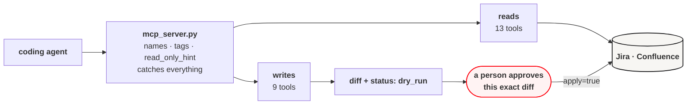

<picture>
  <source media="(prefers-color-scheme: dark)" srcset="docs/assets/banner-dark.svg">
  
</picture>

[](https://github.com/danielvogler/atlassian_agent/actions/workflows/ci.yml)
[](https://pypi.org/project/atlassian-agent-mcp/)
[](./LICENSE)
[](https://www.python.org/downloads/)
[](https://docs.astral.sh/uv/)
[](https://docs.astral.sh/ruff/)
[](https://mypy-lang.org/)
[](https://pre-commit.com/)
[](https://github.com/gitleaks/gitleaks)

---

## Start here

Point your coding agent at **[AGENTS.md](./AGENTS.md)** — from a clone, or from
`uvx atlassian-agent-mcp` if you only want to use it — and tell it what you
want done.

```
Read AGENTS.md and set this up. I want you to be able to read our
Confluence space and file Jira tickets from here.
```

That file is written for exactly this: setup, the twenty-two tools, and — the
part that matters — the rules an agent has to follow before it writes anything
to a system your colleagues are reading.

The rest of this page is what the agent is working from.

---

## What it does

It gives a coding agent an MCP server with **twenty-two tools** against a
self-hosted Jira and Confluence. Thirteen read. Nine write.

**Every write is a dry run until somebody says otherwise.** Call
`confluence_append_sentence` and you get back a unified diff and the page it
would land on. Nothing has happened. Passing `apply=true` is a separate,
deliberate second call, made after a person has seen that diff — and that is
the point, because the failure mode here is not an agent that cannot edit a
wiki. It is an agent that edits the wrong one, confidently, while nobody is
looking.

**Confluence page writes also carry the version that was read.** If the page
moved in between, the update refuses rather than publishing a body built from
a page that no longer exists — which would silently revert whoever edited it in
the meantime. An optimistic-concurrency check is unglamorous and it is the
difference between a tool you can leave running and one you cannot.

---

## Install

Two routes, and the only question is whether you intend to change the code.

**To use it**, nothing to clone — it is on PyPI as **`atlassian-agent-mcp`**
(the name `atlassian-agent` belongs to an unrelated project; the import package
here is still `atlassian_agent`):

```bash
uvx atlassian-agent-mcp        # run it, fetching it on demand
uv tool install atlassian-agent-mcp   # or keep it installed
```

**To change it**, clone and:

```bash
make setup       # venv, dependencies, git hooks, .env from the template
```

## Credentials

A base URL and a personal access token per service, both sent as
`Authorization: Bearer <token>`:

```bash
CONFLUENCE_URL=https://confluence.example.com
CONFLUENCE_TOKEN=your-personal-access-token
JIRA_URL=https://jira.example.com
JIRA_TOKEN=your-personal-access-token
```

Jira is optional — without it the Confluence tools still work, and the `jira_*`
tools return a clear error rather than failing obscurely.

**Where those live depends on how you installed it.** From a clone they go in
`.env`, which is gitignored, which a pre-commit hook refuses to commit, and
which the local file tools refuse to read. An installed copy has no repository
to hold a `.env`, so the variables come from the agent client's own config —
the `env` block below. Nothing else changes: the server reads the environment
either way, and a missing variable is an error rather than a guess.

Check the wiring without spending a credential:

```bash
make mcp-tools   # lists all twenty-two tools; never calls Atlassian
```

## Wiring it into an agent

**Installed** — the portable form, and the one to hand a colleague. It needs
nothing on disk but the client's config file:

```json
{
  "mcpServers": {
    "atlassian": {
      "command": "uvx",
      "args": ["atlassian-agent-mcp"],
      "env": {
        "CONFLUENCE_URL": "https://confluence.example.com",
        "CONFLUENCE_TOKEN": "${CONFLUENCE_TOKEN}",
        "JIRA_URL": "https://jira.example.com",
        "JIRA_TOKEN": "${JIRA_TOKEN}"
      }
    }
  }
}
```

Those `${...}` are deliberate. Most clients — Claude Code among them — expand
environment variables in this file, so the token stays in your shell or your
keychain and the config stays a file you can commit to a team repository. A
client that does not expand them leaves you pasting a live token into a
plaintext file that syncs to wherever your dotfiles sync; if that is where you
are, use the clone route and `.env` instead.

For Claude Code, the same thing from the command line:

```bash
claude mcp add atlassian \
  --env CONFLUENCE_URL=https://confluence.example.com \
  --env CONFLUENCE_TOKEN="$CONFLUENCE_TOKEN" \
  -- uvx atlassian-agent-mcp
```

**From a clone**, the entrypoint is `scripts/run-atlassian-agent-mcp.sh`, which
runs the server from the repository's own virtualenv and picks up that
repository's `.env` — so no credential goes into the client's config at all:

```bash
claude mcp add atlassian-agent -- /absolute/path/to/atlassian_agent/scripts/run-atlassian-agent-mcp.sh
```

Restart the client afterwards, then ask it to list its tools. Twenty-two, or
something is wrong.

---

## The tools

Reads — safe to call freely:

| Tool | What it gives you |
|---|---|
| `confluence_search` | CQL search — how you find a page you were not handed the URL for |
| `confluence_get_page` | Title, ID, version, and the body — raw storage, or `body_format="text"` with markup stripped |
| `confluence_get_page_family` | A page plus descendants (depth ≤ 4) with text previews, for choosing where to edit |
| `confluence_get_page_history` | Who created the page and who last changed it — the question a refused update raises |
| `confluence_get_comments` | Page comments, where review feedback usually lives |
| `confluence_get_labels` | Labels on a page, which `label = ...` searches depend on |
| `confluence_get_attachments` | Attached files: name, media type, size. Metadata only |
| `jira_search` | JQL search |
| `jira_get_issue` | One issue by key |
| `jira_get_transitions` | The transitions an issue currently offers, and the status each leads to |
| `jira_get_structure` | Jira Structure metadata |
| `jira_get_structure_forest` | Structure rows: row ID, depth, item identity |
| `jira_get_structure_values` | Text-formatted values for selected Structure rows |

Writes — a diff and nothing else unless `apply=true`:

| Tool | Note |
|---|---|
| `confluence_add_comment` | Additive and reversible; often the right tool where an edit is reached for |
| `confluence_add_labels` | Adds only; never removes. `unchanged` when every label is already there |
| `confluence_create_page` | Creates a new page in a space, optionally under a parent; refuses a duplicate title |
| `confluence_update_page` | Also requires `expected_version` from the read |
| `confluence_append_sentence` | Appends one paragraph; returns `unchanged` if the sentence is already there |
| `jira_create_issue` | Resolves project and issue type against create metadata first |
| `jira_update_issue_fields` | |
| `jira_add_comment` | |
| `jira_transition_issue` | Takes the target *status*, not the transition name |

Reads accept a page URL, a `/x/` tiny link, or a numeric ID. Tiny links are
resolved by following them, and the host must match `CONFLUENCE_URL` — an agent
handed a link to somewhere else does not send your token there.

Every tool returns a `status`: `success`, `dry_run`, `unchanged`, or `error`
with a `message`. Errors are returned rather than raised, so one bad call does
not take down the agent's session.

---

## How it fits together



`mcp_server.py` derives each tool's public name, its tags, and its
`read_only_hint` / `destructive_hint` annotations from the function name, so the
client's own idea of which tools are safe comes from the same place the tools
do. `make check` lists the registered tools, because a tool that fails to
register still lints and still tests green — and shows up only in somebody's
agent session.

---

## Diagnostic CLI

For smoke tests and direct diagnostics, not the main interface:

```bash
make page   PAGE_URL=https://confluence.example.com/x/abc123
make family PAGE_URL=https://confluence.example.com/x/abc123
make append PAGE_URL=https://confluence.example.com/x/abc123 SENTENCE="Hello."
```

`make append` is a dry run and prints the diff. `make append-apply` publishes.
The underlying command is `uv run atlassian-agent`; `--help` lists it.

## Checks

```bash
make check   # lint, format, mypy, tests, and the MCP tool list — what CI runs
make help    # every target
```

Tests fake the HTTP layer: none of them touch a network or need credentials,
because CI has none and a suite that depends on a live Jira has stopped testing
this repository.

## Releasing

Pushing a `v*` tag publishes to PyPI. There is no token in the repository, in a
secret, or on anyone's laptop: the workflow's own OIDC identity is exchanged for
a credential that lasts minutes. `make release-check` rehearses the whole thing
locally — including installing the built wheel somewhere clean and registering
its tools — and prints the two commands that publish. The procedure is
[AGENTS.md §B5](./AGENTS.md).

## Scope and limits

Built against **self-hosted Jira and Confluence** with personal access tokens —
Atlassian Cloud uses a different auth scheme and is not supported. Confluence
writes operate on the raw storage format, so the agent is editing XHTML rather
than a rendered page. There is no delete tool, and adding one is a decision, not
an increment.

## Further reading

- **[AGENTS.md](./AGENTS.md)** — the source of truth: the tools, the rules for
  writing, and how to change the code
- **[SECURITY.md](./SECURITY.md)** — how credentials are handled, and how to
  report a vulnerability
- **[CHANGELOG.md](./CHANGELOG.md)** — release history

## License

[MIT](./LICENSE)
